<!-- # Terraform AWS Infrastructure Automation Project

## Project Overview

This project demonstrates the use of **Terraform** to provision and automate cloud infrastructure on **AWS**. It follows a modular approach to create:

- A Virtual Private Cloud (VPC)
- An EC2 instance with web server
- An S3 bucket
- Remote backend using S3 + DynamoDB for state management

---

## 📁 Project Information

- **Region**: `ap-south-1` (Mumbai)
- **AMI Used**: `ami-03bb6d83c60fc5f7b` (Amazon Linux 2)
- **Terraform Modules**: `vpc`, `ec2`, `s3`
- **Remote Backend**: S3 + DynamoDB
- **Key Outputs**:
  - EC2 public IP
  - S3 bucket name

---

## 📸 Screenshots & Descriptions

### 1. Terraform Project Folder Structure
  
Shows the organized directory including root files and `modules/` folder with `vpc`, `ec2`, and `s3`.

---

### 2. Terraform Init Command
  
Initializes the Terraform working directory and downloads required providers.

---

### 3. Terraform Plan Output
  
Displays the planned infrastructure actions before applying.

---

### 4. Terraform Apply Confirmation
  
Prompts for confirmation to proceed with infrastructure creation.

---

### 5. Terraform Apply Success
  
Shows successful creation of infrastructure resources.

---

### 6. Terraform Output Values
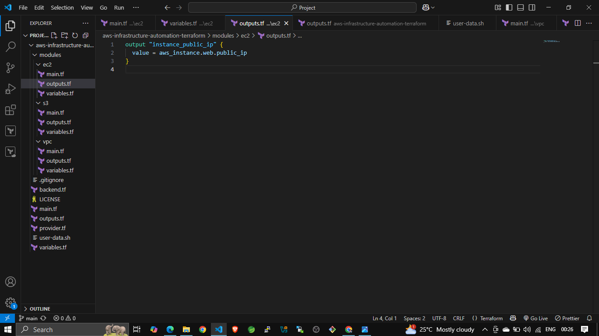  
Displays outputs like EC2 public IP and S3 bucket name after apply.

---

### 7. AWS Console - EC2 Instance
  
Shows the EC2 instance running in the AWS Management Console.

---

### 8. EC2 Public IP - Web Access
  
Verifies web access by visiting EC2 public IP (Apache running).

---

### 9. AWS Console - S3 Bucket
  
Confirms the creation of the S3 bucket via Terraform.

---

### 10. VPC and Subnet Configuration
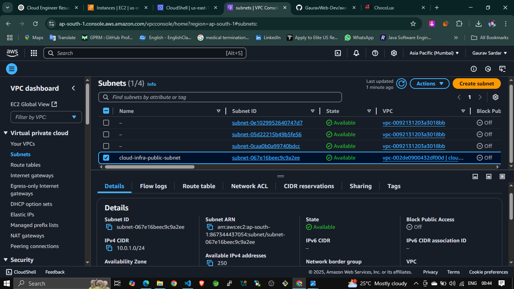  
Shows the created public subnet inside the custom VPC.

---

### 11. AWS Console - VPC Dashboard
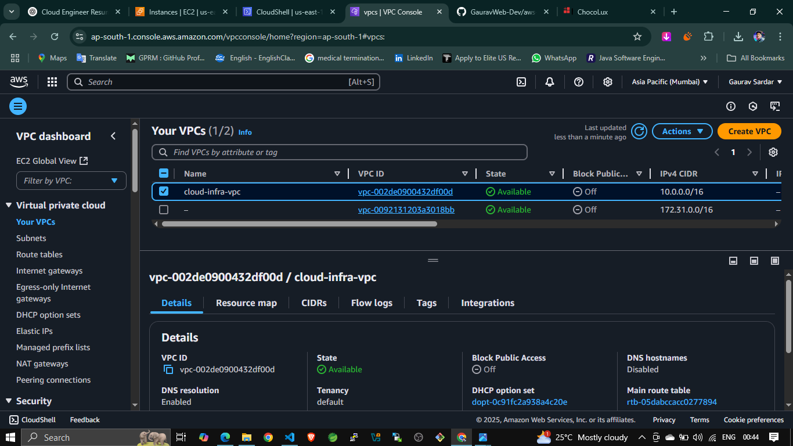  
Verifies the custom VPC exists in the AWS Console.

---

### 12. DynamoDB Table for State Locking
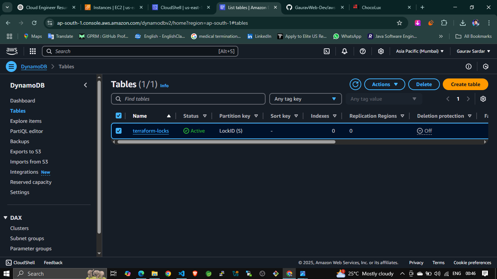  
Displays `terraform-locks` table for state locking.

---

### 13. S3 Bucket for Backend State
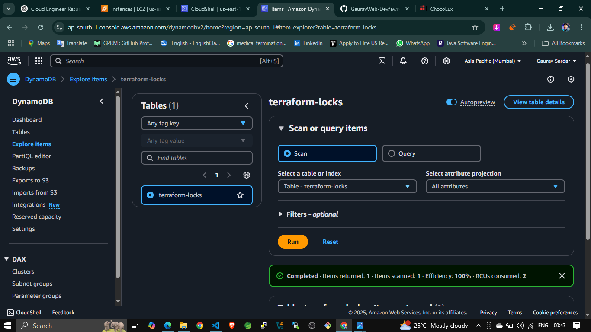  
Shows the S3 bucket configured for remote state storage.

---

### 14. S3 Bucket Versioning Enabled
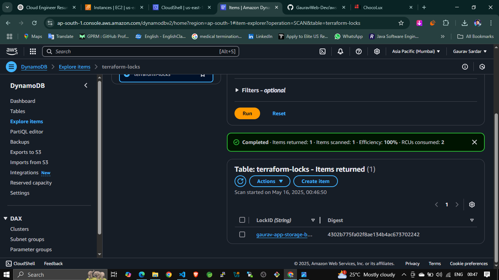  
Verifies versioning is enabled for `.tfstate` history.

---

### 15. Code Editor - main.tf
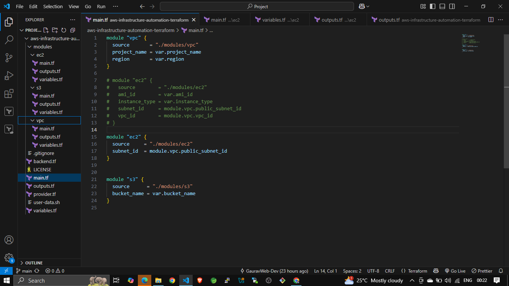  
Shows the root `main.tf` in VS Code.

---

### 16. Code Editor - variables.tf
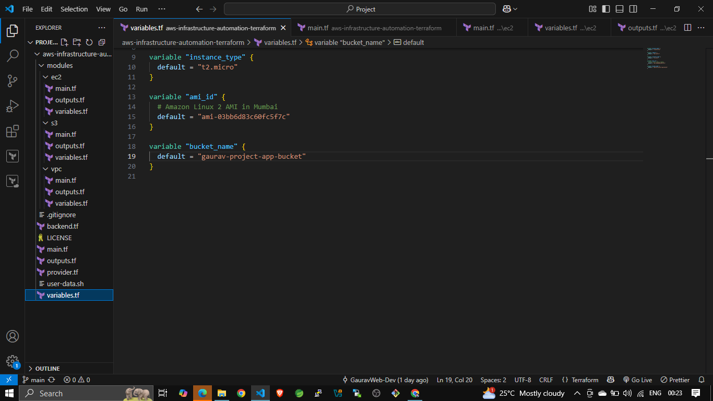  
Displays declared input variables for infrastructure.

---

### 17. Code Editor - outputs.tf
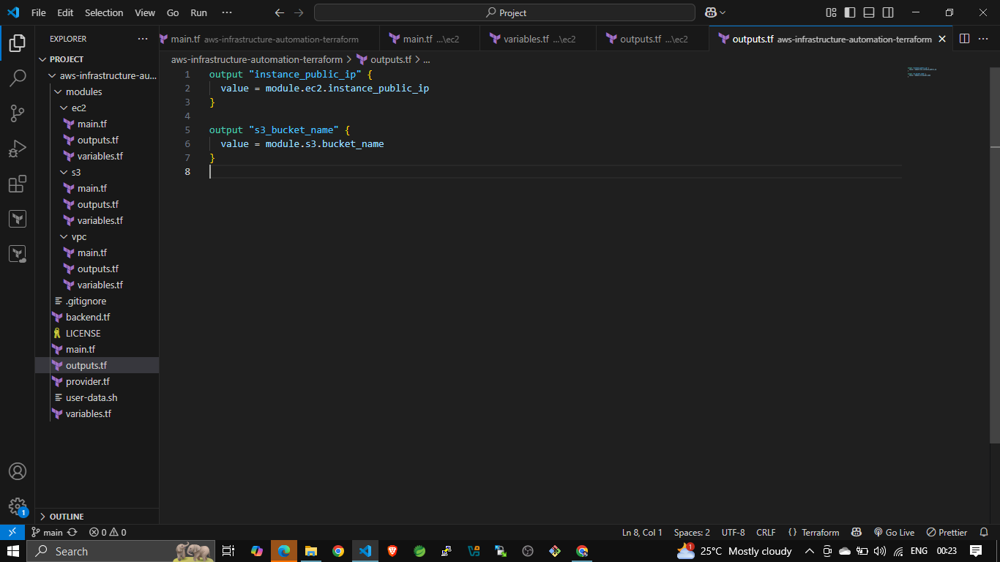  
Shows the output configuration for public IP and bucket.

---

### 18. EC2 Module - main.tf
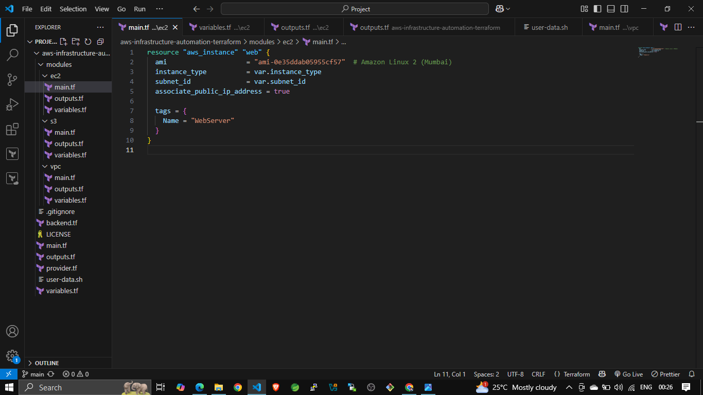  
Terraform code to create the EC2 instance.

---

### 19. EC2 Module - variables.tf
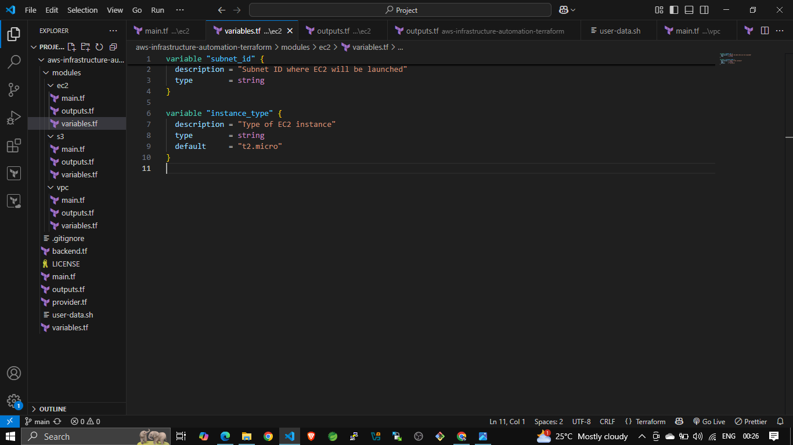  
Variables used for EC2 provisioning.

---

### 20. S3 Module - main.tf
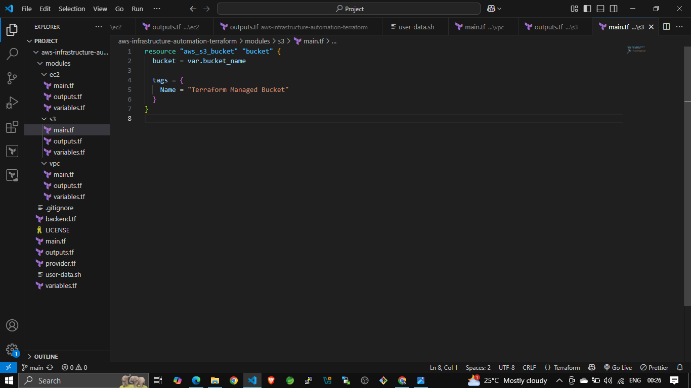  
Code to create and configure the S3 bucket.

---

### 21. S3 Module - outputs.tf
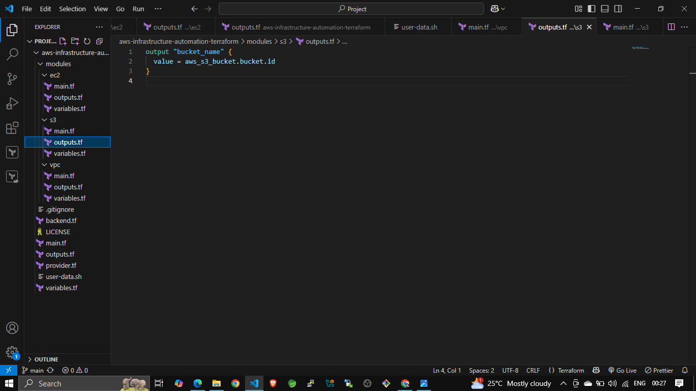  
S3 module outputs like bucket name.

---

### 22. S3 Module - variables.tf
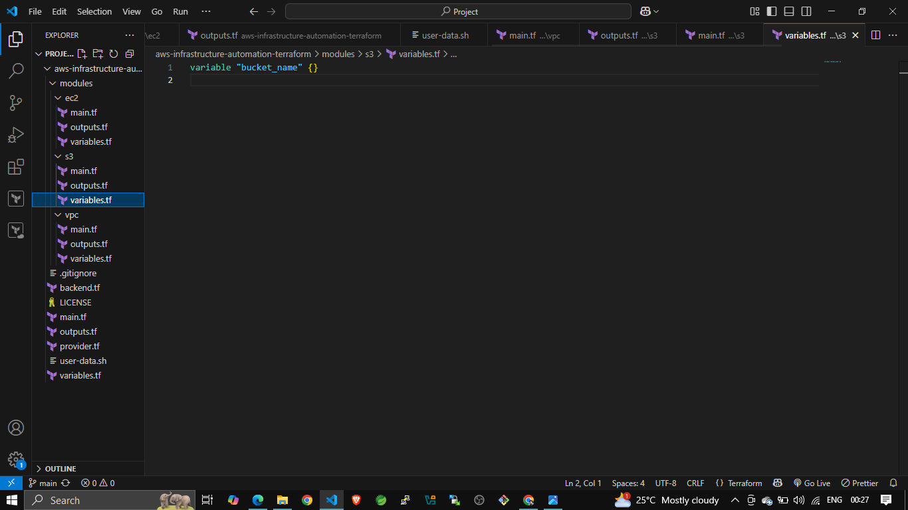  
Input variables for the S3 module.

---

### 23. VPC Module - main.tf
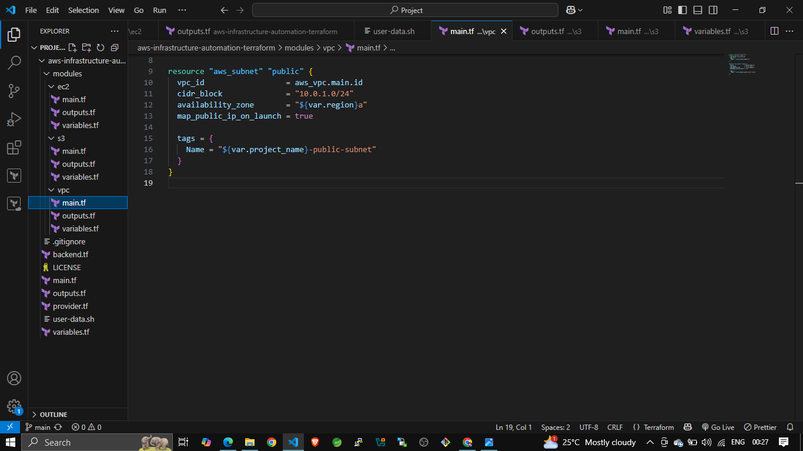  
Defines custom VPC and public subnet.

---

### 24. VPC Module - outputs.tf
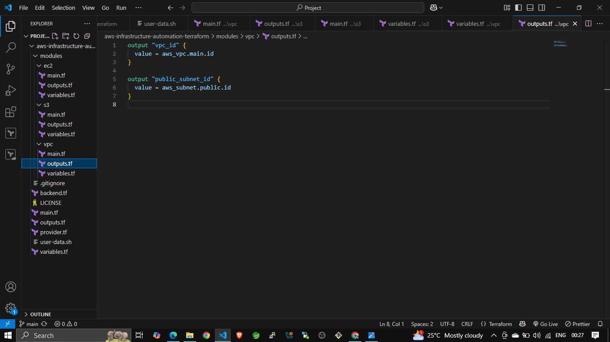  
Outputs like VPC ID and subnet ID.

---

### 25. VPC Module -variables.tf
  
Input variables required for the VPC module.

---

## 🧪 How to Run

1. **Clone this repository**
2. **Configure AWS credentials**
3. **Run the following commands**:

* terraform init
* terraform plan
* terraform apply


## Requirements

* Terraform CLI installed
* AWS CLI configured
* IAM permissions for EC2, S3, VPC, DynamoDB

## Project Info

* Region: ap-south- (Mumbai)
* AMI Used:`ami-03bb6d83c60fc5f7b` (Amazon Linux 2)
* Remote Backend: S3 + DynamoDB
* Modules: vpc, ec2, s3
* Outputs: EC2 public IP and S3 bucket name

 Author
Gaurav Sardar
Cloud/DevOps Enthusiast | Trained in AWS, Linux, Terraform. -->

#  Terraform AWS Infrastructure Automation Project

##  Project Overview

This project demonstrates the use of **Terraform** to automate the provisioning of cloud infrastructure on **AWS**. It follows a modular approach to create:

- A **Virtual Private Cloud (VPC)**
- An **EC2 instance** with a web server (Apache)
- An **S3 bucket**
- **Remote backend** using S3 and DynamoDB for Terraform state management

---

##  Project Information

- **Region**: `ap-south-1` (Mumbai)
- **AMI Used**: `ami-03bb6d83c60fc5f7b` (Amazon Linux 2)
- **Terraform Modules**: `vpc`, `ec2`, `s3`
- **Remote Backend**: S3 + DynamoDB
- **Key Outputs**:
  - EC2 public IP
  - S3 bucket name

---

## 📸 Screenshots & Descriptions

### 1. Project Folder Structure  
  
Organized directory with root files and `modules/` for `vpc`, `ec2`, and `s3`.

### 2. Terraform Init  
  
Initializes the Terraform working directory.

### 3. Terraform Plan  
  
Shows planned actions before applying infrastructure changes.

### 4. Apply Confirmation  
  
Prompt for approval before applying resources.

### 5. Apply Success  
  
Confirmation of successful infrastructure provisioning.

### 6. Terraform Outputs  
  
Outputs like EC2 public IP and S3 bucket name.

### 7. EC2 Instance in AWS  
  
EC2 instance details in AWS Console.

### 8. Web Access via EC2 Public IP  
  
Accessing Apache welcome page via EC2 public IP.

### 9. S3 Bucket  
  
S3 bucket created using Terraform.

### 10. VPC Subnet  
  
Public subnet created inside the custom VPC.

### 11. VPC Console  
  
Custom VPC shown in AWS Console.

### 12. DynamoDB Table  
  
`terraform-locks` table for remote state locking.

### 13. S3 Backend Bucket  
  
S3 bucket used to store `.tfstate`.

### 14. S3 Versioning  
  
Versioning enabled on the backend bucket.

### 15. Root main.tf  
  
Infrastructure definitions in `main.tf`.

### 16. Root variables.tf  
  
Input variables defined here.

### 17. Root outputs.tf  
  
Outputs such as EC2 public IP and bucket name.

### 18. EC2 Module - main.tf  
  
Resource definition for EC2 instance.

### 19. EC2 Module - variables.tf  
  
Input variables for EC2 instance.

### 20. S3 Module - main.tf  
  
Resource definition for S3 bucket.

### 21. S3 Module - outputs.tf  
  
Output values from the S3 module.

### 22. S3 Module - variables.tf  
  
Input variables for S3 bucket creation.

### 23. VPC Module - main.tf  
  
Resource definition for custom VPC and subnet.

### 24. VPC Module - outputs.tf  
  
Outputs like VPC ID and subnet ID.

### 25. VPC Module - variables.tf  
  
Input variables for the VPC module.

---

##  How to Run

1. **Clone this repository**
2. **Configure AWS credentials** (`aws configure`)
3. Run the following commands:

```bash
terraform init
terraform plan
terraform apply
````

---

##  Requirements

* Terraform CLI
* AWS CLI
* AWS IAM permissions for EC2, S3, VPC, and DynamoDB

---

## Author

**Gaurav Sardar**
Cloud/DevOps Enthusiast | Trained in **AWS**, **Linux**, and **Terraform**

---
