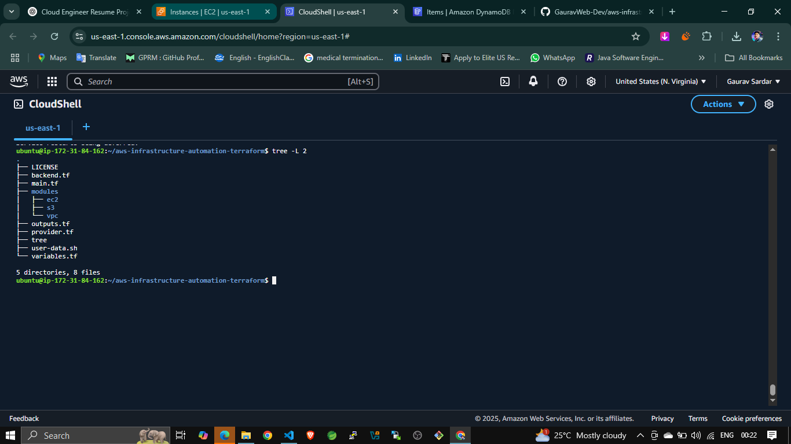
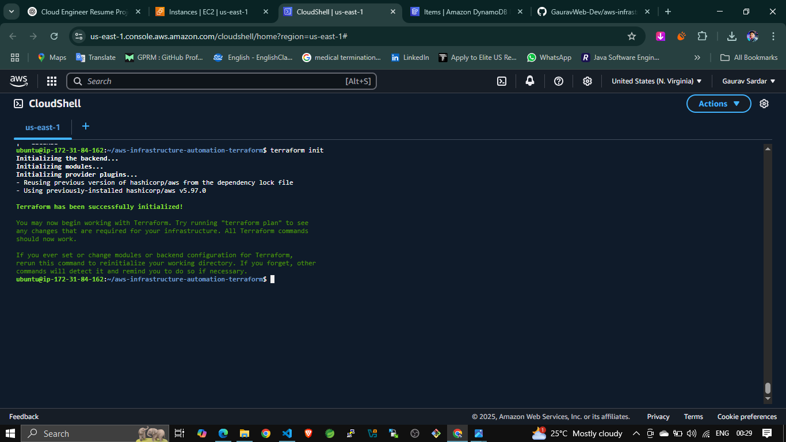
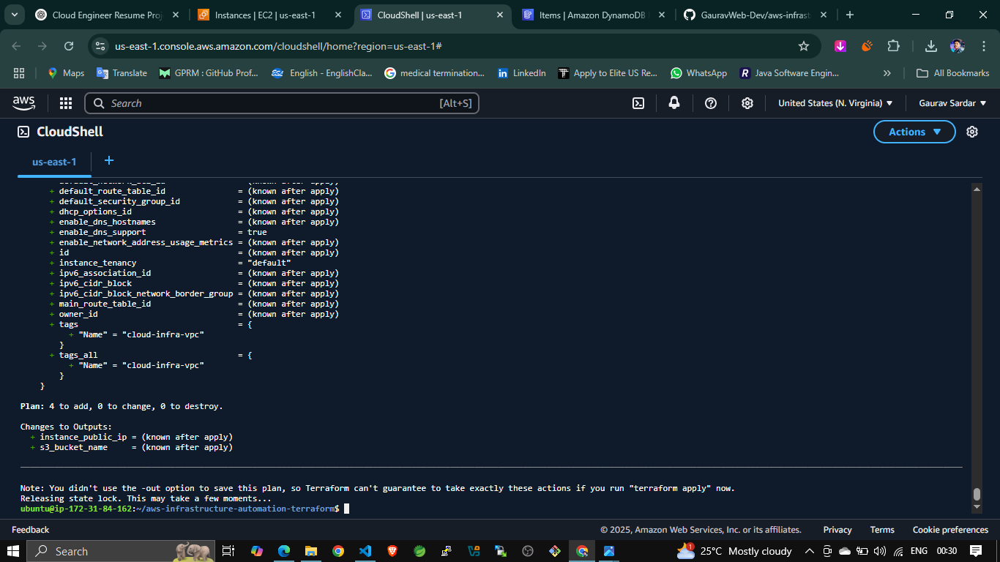
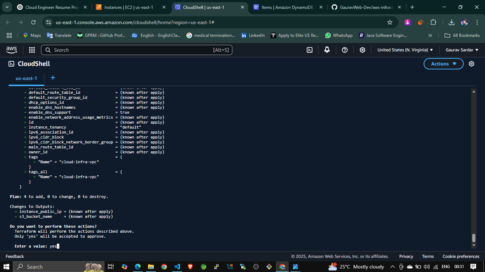
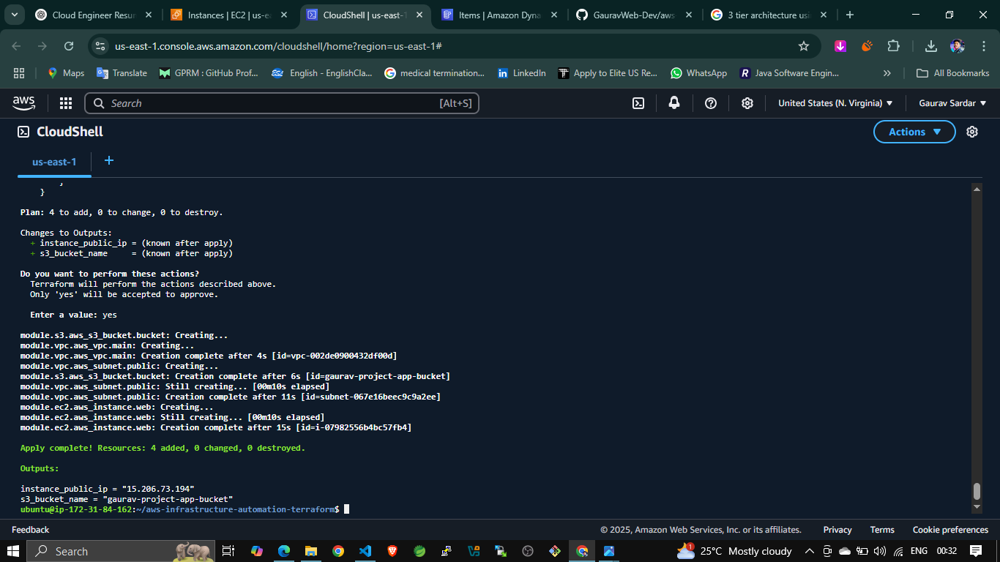
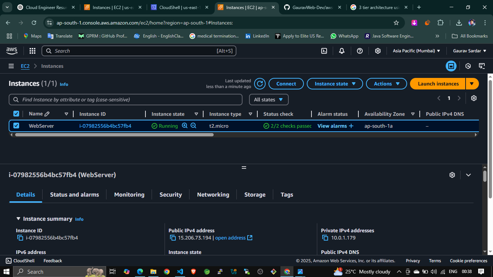
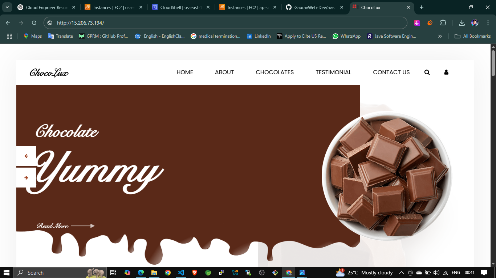
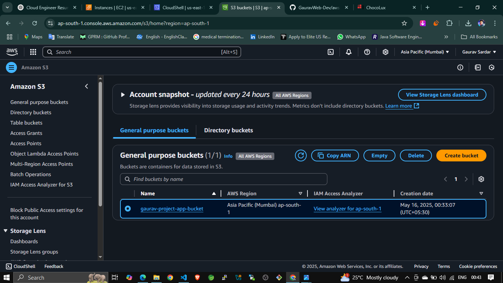

# Terraform AWS Infrastructure Automation Project

## Project Overview

This project demonstrates the use of **Terraform** to provision and automate cloud infrastructure on **AWS**. It follows a modular approach to create:

- A Virtual Private Cloud (VPC)
- An EC2 instance with web server
- An S3 bucket
- Remote backend using S3 + DynamoDB for state management

---

## Project Structure

### Folder Structure

  
Organized Terraform project with root configuration files and separate module folders for `vpc`, `ec2`, and `s3`.

---

## Terraform Commands and Output

### Terraform Initialization

  
Initializes the Terraform working directory and downloads necessary provider plugins.

---

### Terraform Plan

  
Previews the infrastructure resources Terraform will create, modify, or destroy.

---

### Terraform Apply Confirmation

  
Shows the confirmation prompt before applying changes to AWS infrastructure.

---

### Apply Success Output

  
Displays a message confirming successful resource creation and output values.

---

## AWS Console Verifications

### EC2 Instance in AWS Console

  
Confirms the EC2 instance (`WebServer`) is created and running in the AWS Console.

---

### EC2 Browser Access

  
Verifies that the EC2 instance is accessible via its public IP with a working web server.

---

### S3 Bucket in AWS Console

  
Shows the S3 bucket (`gaurav-project-app-bucket`) successfully created via Terraform.

---

### VPC and Subnet in AWS Console

  
Displays the custom VPC and associated public subnet.

---

## Remote Backend Setup (Optional)

### DynamoDB Lock Table

  
Used for state locking to prevent simultaneous modifications.

---

### S3 Bucket for Backend

  
Stores the Terraform state file for consistent team collaboration.

---

## Terraform Code View

### Main Terraform Configuration

### Variables File

### Outputs File

---

## VPC Module

### VPC Main File

### VPC Variables

### VPC Outputs

---

## EC2 Module

### EC2 Main File

### EC2 Variables

### EC2 Outputs

---

## S3 Module

### S3 Main File

### S3 Variables

### S3 Outputs

---

## Code in VS Code Editor

  
Provides a view of clean, modular Terraform code opened in Visual Studio Code.

---

## How to Use

1. Clone the repository:
   git clone https://github.com/your-username/aws-infrastructure-automation-terraform.git
   cd aws-infrastructure-automation-terraform

2. Initialize the working directory:

   terraform init

3. Preview the resources:

   terraform plan

4. Apply the configuration:

   terraform apply

## Requirements

* Terraform CLI installed
* AWS CLI configured
* IAM permissions for EC2, S3, VPC, DynamoDB

## Project Info

* **Region:** ap-south-1 (Mumbai)
* **AMI Used:** `ami-03bb6d83c60fc5f7b` (Amazon Linux 2)
* **Remote Backend:** S3 + DynamoDB
* **Modules:** vpc, ec2, s3
* **Outputs:** EC2 public IP and S3 bucket name

 Author
Gaurav Sardar
Cloud/DevOps Enthusiast | Trained in AWS, Linux, Terraform.
